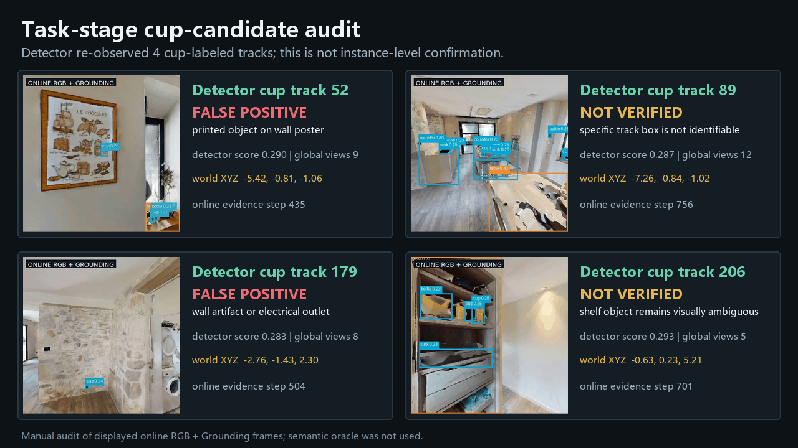

# RSC-Nav

Reusable semantic-spatial memory for language-conditioned embodied navigation.

RSC-Nav studies a map-then-task navigation loop: an agent first builds reusable object-centric semantic memory, then an API planner selects executable semantic waypoints from that memory, and execution feedback can update confidence, freshness, and future replanning decisions.

## Demo

### Case: Real-time environment familiarization followed by a "find and report all cups" task


The GIF shows:

- online RGB + GroundingDINO observations and current depth;
- online BEV, route history, object memory, and policy state;
- real-time task-independent environment familiarization;
- Qwen3-Max task injection at step 360 and semantic candidate execution.

The public replay preserves all 257 sampled frames and lasts about 30.7 seconds
at 25x normal action speed. The underlying 771-step run averages 800 ms per
online loop and reaches 94.6% post-hoc navmesh observation coverage. During
task execution, the detector re-observes four tracks labeled as `cup`; this is
not instance-level confirmation. Manual review finds two clear false positives
and two visually unresolved candidates, so this run demonstrates the live
closed loop but does **not** establish successful cup-task completion. One
recorded guided correction occurs during familiarization; it is disclosed in
the report and does not teleport the agent. Semantic oracle data is unavailable
to the online policy. Exact Habitat pose and complete-scene navmesh shortest
paths remain privileged geometric inputs and are reported as current
limitations.

#### Task-result visual audit



The full public result index is available at:

```text
outputs/paper_public_index.html
```

## Current Position

The current Habitat demo now runs online interest exploration, memory updates,
API task planning, and execution in one episode. It still uses simulator exact
pose for projection and complete-scene navmesh queries for low-level execution,
so it validates the semantic loop rather than a full real-world localization
stack.

The real-world roadmap explicitly includes:

- real computed localization with SLAM/VIO/wheel odometry/relocalization uncertainty;
- observed-BEV-only execution without privileged global navmesh paths;
- API completion criteria, failure recovery, and replanning;
- real RGB-D validation of LingBot-Depth as an optional repair branch.

Completed research branches now include interest-driven exploration and
LingBot-Map/Vision/Depth benchmarking. LingBot-Map-long is the strongest current
RGB-only geometry candidate; LingBot-Vision does not yet replace GroundingDINO,
and LingBot-Depth did not improve the current clean Habitat-depth BEV baseline.

## Core Idea

RSC-Nav is not just another VLN planner or BEV mapping baseline. The main contribution target is:

```text
RGB-D / semantic observations
-> object-centric reusable semantic memory
-> memory-grounded API planner
-> semantic waypoint / stopover execution
-> observe / update / replan-ready loop
```

The memory stores object category, spatial position, confidence, freshness, positive evidence, expected-visible misses, stale/missing status, and planner-facing waypoint candidates.

## Repository Layout

```text
src/
  dense_bev_mapper.py              # metric BEV occupancy / depth projection
  semantic_bev_memory.py           # semantic evidence accumulation
  object_memory_store.py           # reusable object memory and confidence update
  interest_exploration.py          # frontier/semantic interest scoring and pathing
  online_semantic_task_planner.py  # Qwen3-Max semantic candidate planner
  landmark_retrieval.py            # landmark retrieval / ranking
  semantic_grounding_adapter.py    # grounding adapter contracts

scripts/
  phase23_habitat_control_server.py          # live Habitat control UI
  phase5a_online_interest_explorer.py        # online observe-ground-map-plan-act loop
  phase5a_online_interest_report.py          # synchronized online demo report
  groundingdino_online_worker.py             # detector worker process
  lingbot_map_online_worker.py               # optional LingBot geometry worker
  m25_habitat_rgbd_export.py                 # zero-map RGB-D/pose capture
  m25_groundingdino_export.py                # open-vocabulary grounding + 3D projection
  phase5a_active_table_search_capture.py     # close multi-view tabletop search
  phase5a_zero_map_cup_search_report.py      # final GIF/video/metrics report
  phase5a_sim_language_demo.py               # natural-language -> API planner -> Habitat demo
  phase5a_make_grounding_depth_storyboard.py # GIF storyboard generation
  phase5a_api_semantic_planner_eval.py       # API planner evaluation
  phase5a_navmesh_validate.py                # Habitat navmesh validation

docs/
  demo_drink_water_reusable_semantic_memory.md
  phase_docs/phase5_navigation_policy.md
  phase_docs/phase_log_audit_20260704.md

outputs/
  phase5a_sim_demo/                 # curated demo reports/GIFs/videos/traces
  m3_lingbot_foundation_benchmark/  # curated LingBot Map/Depth/Vision benchmark
  phase5a_api_semantic_planner/      # curated qwen3-max planner reports
  phase5a_navmesh_validation/        # curated navmesh validation reports
  m35_semantic_representation_alignment/
```

Large model weights, third-party downloads, WSL images, and full raw experiment outputs are intentionally ignored by Git.

## API Planner

The selected Phase5A API planner is:

```text
provider: DashScope OpenAI-compatible
base_url: https://dashscope.aliyuncs.com/compatible-mode/v1
model: qwen3-max
key env: DASHSCOPE_API_KEY or OPENAI_API_KEY
```

API keys are not stored in this repository. Before running API demos, inject a key in the runtime environment, for example:

```bash
export DASHSCOPE_API_KEY=...
export OPENAI_BASE_URL=https://dashscope.aliyuncs.com/compatible-mode/v1
export OPENAI_MODEL=qwen3-max
```

## Reproduce The Demo

On a development machine with `habitat-sim` and GroundingDINO dependencies,
run the online loop directly:

```bash
python scripts/phase5a_online_interest_explorer.py \
  --scene /path/to/GLAQ4DNUx5U.basis.glb \
  --scene-dataset-config /path/to/hm3d_annotated_basis.scene_dataset_config.json \
  --out-dir outputs/online_interest_run \
  --max-steps 780 \
  --frontier-strategy hierarchical \
  --execution-planner hybrid_navmesh \
  --task-planner-mode api \
  --task-text "Find all cups in the room and report their locations"
```

The published case also uses
`--guided-correction-position-xyz 0.059 -1.593 8.886` at step 120. This
correction is explicit in the report and is not counted as autonomous
exploration. Configure separate detector and LingBot runtimes with
`RSCNAV_DETECTOR_PYTHON`, `RSCNAV_LINGBOT_PYTHON`,
`RSCNAV_LINGBOT_REPO`, and `RSCNAV_LINGBOT_MODEL`.

Create the compact public replay and target evidence sheet with:

```bash
python scripts/phase5a_make_public_25x_demo.py \
  --input-gif outputs/online_interest_run/report/online_interest_exploration.gif \
  --summary-json outputs/online_interest_run/online_summary.json \
  --output-gif outputs/online_interest_run/report/online_interest_exploration_25x.gif \
  --output-showcase outputs/online_interest_run/report/cup_candidate_audit.png \
  --playback-speed 25 \
  --source-step-stride 3 \
  --target-audit "52:FALSE POSITIVE:printed object on wall poster" \
  --target-audit "89:NOT VERIFIED:specific track box is not identifiable" \
  --target-audit "179:FALSE POSITIVE:wall artifact or electrical outlet" \
  --target-audit "206:NOT VERIFIED:shelf object remains visually ambiguous"
```

## Key Reports

- `outputs/phase5a_api_semantic_planner/api_model_benchmark_20260703/api_model_benchmark.html`
- `outputs/phase5a_api_semantic_planner/qwen3_max_20case_noleak_20260703/qwen3_max_20case_noleak_report.html`
- `outputs/phase5a_navmesh_validation/qwen3_max_find5_20260704/navmesh_validation_report.html`
- `outputs/m35_semantic_representation_alignment/paper_semantic_bev_index_20260703.html`
- `outputs/m3_lingbot_foundation_benchmark/lingbot_benchmark_summary.html`
- `outputs/phase5a_sim_demo/full_demo_autonomous_guided_api_task_final_v3_20260724/report/online_interest_exploration.html`

## Status

Current status: demo-ready research prototype.

Validated:

- qwen3-max semantic waypoint selection;
- Habitat navmesh reachability for selected waypoint targets;
- online interest-driven familiarization and frontier exploration;
- GroundingDINO-to-depth-to-world projection and multi-view object memory;
- delayed API task injection with memory-grounded candidate ordering;
- positive / not-observable / expected-visible-miss evidence updates;
- LingBot Map/Depth/Vision benchmark and integration recommendations;
- explicit limitations for localization, privileged navmesh execution, and task completion.
