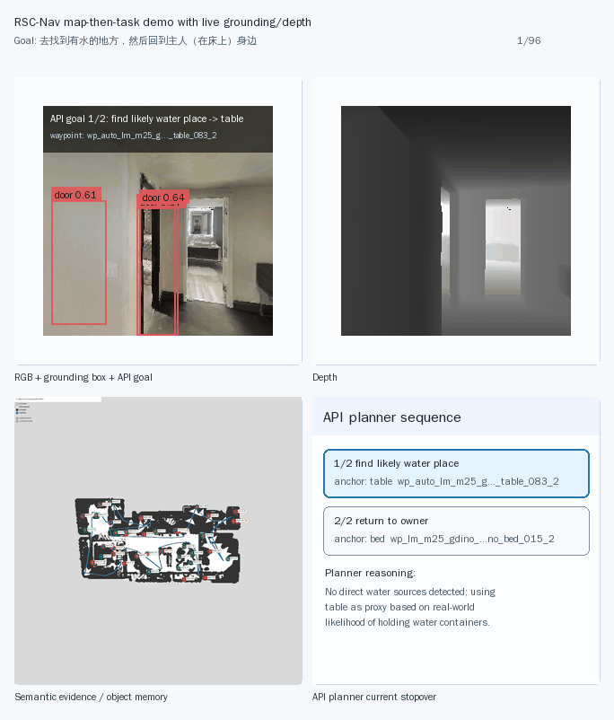

# RSC-Nav

Reusable semantic-spatial memory for language-conditioned embodied navigation.

RSC-Nav studies a map-then-task navigation loop: an agent first builds reusable object-centric semantic memory, then an API planner selects executable semantic waypoints from that memory, and execution feedback can update confidence, freshness, and future replanning decisions.

## Demo

### Case: find a water place, then return to the owner near the bed



The GIF shows:

- first-person RGB with grounding boxes, object labels, and API-planner subgoals;
- depth observation;
- object-centric semantic evidence / memory;
- the current API-planner stopover and reasoning.

The full public result index is available at:

```text
outputs/paper_public_index.html
```

## Current Position

Current Habitat demos use simulator exact pose for depth projection and semantic evidence accumulation. This validates the semantic-memory-to-planner-to-execution loop, not a full real-world localization system.

The real-world roadmap explicitly includes:

- interest-driven exploration instead of scripted coverage loops;
- Lingbo vision/depth model trials;
- real computed localization with SLAM/VIO/wheel odometry/relocalization uncertainty;
- API planner demo refinement with target verification, negative evidence, memory update, and replanning.

## Core Idea

RSC-Nav is not just another VLN planner or BEV mapping baseline. The main contribution target is:

```text
RGB-D / semantic observations
-> object-centric reusable semantic memory
-> memory-grounded API planner
-> semantic waypoint / stopover execution
-> observe / update / replan-ready loop
```

The memory stores object category, spatial position, confidence, freshness, positive evidence, expected-visible misses, stale/missing status, and planner-facing waypoint candidates.

## Repository Layout

```text
src/
  dense_bev_mapper.py              # metric BEV occupancy / depth projection
  semantic_bev_memory.py           # semantic evidence accumulation
  object_memory_store.py           # reusable object memory and confidence update
  landmark_retrieval.py            # landmark retrieval / ranking
  semantic_grounding_adapter.py    # grounding adapter contracts

scripts/
  phase23_habitat_control_server.py          # live Habitat control UI
  phase5a_sim_language_demo.py               # natural-language -> API planner -> Habitat demo
  phase5a_make_grounding_depth_storyboard.py # GIF storyboard generation
  phase5a_api_semantic_planner_eval.py       # API planner evaluation
  phase5a_navmesh_validate.py                # Habitat navmesh validation

docs/
  demo_drink_water_reusable_semantic_memory.md
  phase_docs/phase5_navigation_policy.md
  phase_docs/phase_log_audit_20260704.md

outputs/
  phase5a_sim_demo/                 # curated demo reports/GIFs/videos/traces
  phase5a_api_semantic_planner/      # curated qwen3-max planner reports
  phase5a_navmesh_validation/        # curated navmesh validation reports
  m35_semantic_representation_alignment/
```

Large model weights, third-party downloads, WSL images, and full raw experiment outputs are intentionally ignored by Git.

## API Planner

The selected Phase5A API planner is:

```text
provider: DashScope OpenAI-compatible
base_url: https://dashscope.aliyuncs.com/compatible-mode/v1
model: qwen3-max
key env: DASHSCOPE_API_KEY or OPENAI_API_KEY
```

API keys are not stored in this repository. Before running API demos, inject a key in the runtime environment, for example:

```bash
export DASHSCOPE_API_KEY=...
export OPENAI_BASE_URL=https://dashscope.aliyuncs.com/compatible-mode/v1
export OPENAI_MODEL=qwen3-max
```

## Reproduce The Demo

On the development machine with `habitat-sim` installed:

```bash
python scripts/phase5a_sim_language_demo.py \
  --scene /path/to/17DRP5sb8fy.glb \
  --scene-dataset-config /path/to/mp3d.scene_dataset_config.json \
  --goal "去找到有水的地方，然后回到主人（在床上）身边" \
  --mode api \
  --model qwen3-max \
  --out-dir outputs/phase5a_sim_demo/water_then_owner_bed_20260704
```

Then regenerate the storyboard GIF:

```bash
python scripts/phase5a_make_grounding_depth_storyboard.py \
  --scene /path/to/17DRP5sb8fy.glb \
  --scene-dataset-config /path/to/mp3d.scene_dataset_config.json \
  --out-dir outputs/phase5a_sim_demo/water_then_owner_bed_20260704
```

## Key Reports

- `outputs/phase5a_api_semantic_planner/api_model_benchmark_20260703/api_model_benchmark.html`
- `outputs/phase5a_api_semantic_planner/qwen3_max_20case_noleak_20260703/qwen3_max_20case_noleak_report.html`
- `outputs/phase5a_navmesh_validation/qwen3_max_find5_20260704/navmesh_validation_report.html`
- `outputs/m35_semantic_representation_alignment/paper_semantic_bev_index_20260703.html`

## Status

Current status: demo-ready research prototype.

Validated:

- qwen3-max semantic waypoint selection;
- Habitat navmesh reachability for selected waypoint targets;
- first-person execution trace with stop-and-look behavior;
- RGB grounding + depth + semantic evidence storyboard;
- explicit backlog for localization, interest exploration, Lingbo model trials, and API planner demo refinement.
